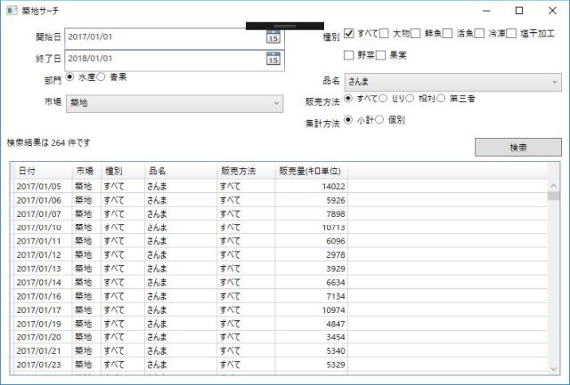
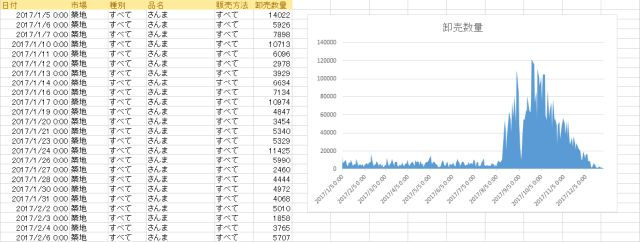

# Tsukizi-Search

[東京都中央卸売市場日報](http://www.shijou-nippo.metro.tokyo.jp/) で公開されているデータを検索するツールです。日報データは、一度 Azure cosmos DB に吸い上げて検索するようにしています。

現在のところ過去5年間のデータ（2013年1月から2018年10月末まで）があります。

## TsukiziSearch.Win 

条件を設定して検索ができます。グリッドは Ctrl+C でコピーができるので、Excel に貼り付けてグラフ化できます。





- API key は読み取り専用のものです。Azure cosoms DB のアクセス流用に応じて制限することがあります。
- 整形済みの5年間のCSV形式のデータは <https://1drv.ms/u/s!AmXmBbuizQkXgpUYeqUVYd7WhAl4uw> にあるので活用してください。

## tsukizidata

[東京都中央卸売市場日報](http://www.shijou-nippo.metro.tokyo.jp/) からCSV形式でデータを取得します。.NET Core 環境のため、Windows/Linux などで動作します。

```
# 水産の 2018/11/13 のデータを取得
tukizidata get sui 20181113
# 青果の 2018/11/13 のデータを取得
tukizidata get sei 20181113
```

- 日報に上がっているデータを整形して、CSV 形式に変換します
- ファイル名は sui_20181113.csv のほうに保存します

Azure Cosoms DB へ更新するためには別途書き込み用の apikey が必要になります。メンテナンス用のコマンドとして put/del を用意していますが、一般公開をする予定はありません。 

# Author 

- tomoaki masuda 

# License

- MIT


